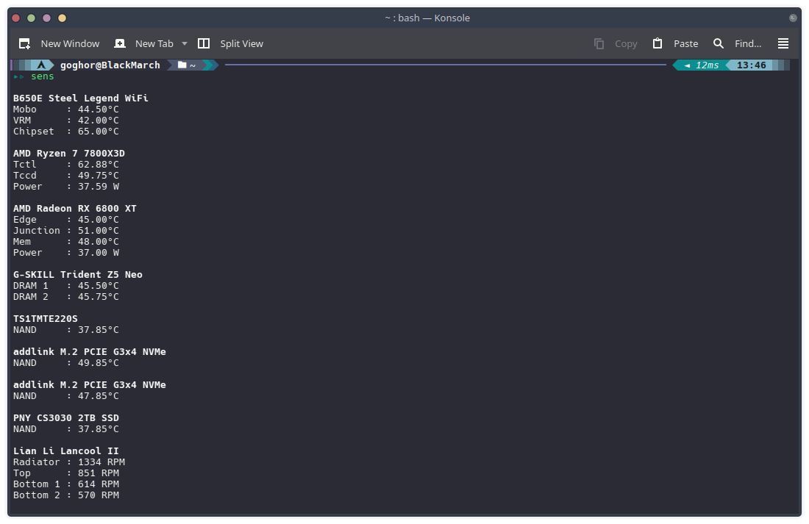
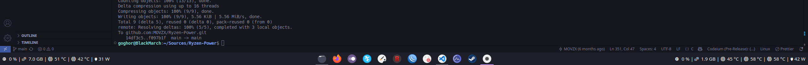

# Ryzen Power

Command-line utilities that read hardware sensors on Linux. They read sysfs, hwmon and
`/proc` directly, and call `dmidecode`, `nvidia-smi` or `rocm-smi` for the rest.

The tools print plain text. `powerusage` uses Nerd Font glyphs, so install a Nerd Font
for correct icons.




## Tools

1. `ryzen` — CPU power draw in watts. Prints one number.
2. `cpuf` — live monitor: CPU name, temperatures, power, and per-core frequency.
3. `powerusage` — one status line for the CPU or the GPU. Made for panels and bars.
4. `sens` — full one-shot sensor report for the whole system.

## Prerequisites

- `gcc`
- `libpci` (needed by `powerusage`; also used by `sens` for NVIDIA GPU register reads)
- `dmidecode` (needed by `sens` for board, CPU and DRAM model strings)
- AMD GPU: `rocm-smi`
- NVIDIA GPU: `nvidia-smi` and the NVIDIA Management Library (NVML)
- Optional: CUDA SDK, used only to detect NVIDIA support at build time

## Build

```bash
./build.sh
```

The script looks for `/opt/cuda`. If it finds that directory, it builds `powerusage`
and `sens` with `-DNVIDIA_GPU`. Otherwise it builds them for AMD or Intel only.

### DRAM temperature (spd5118)

DRAM sensor output is off by default. Enable it at build time:

```bash
ENABLE_DRAM=1 ./build.sh
```

The flag adds a `-DENABLE_DRAM` build of `powerusage cpu` (two extra DRAM readings) and
adds the DRAM section to `sens`. It does not change the binary at runtime, so you must
rebuild to turn it on or off.

## Install

The binaries run from the current directory. To install them on the PATH:

```bash
sudo cp -f ryzen cpuf powerusage sens /usr/local/bin/
```

Reinstall after every rebuild. Otherwise you keep testing the old copy.

## Usage

### `ryzen`

```bash
ryzen
```

Output: one float, watts. Example: `41.77`

### `cpuf`

```bash
cpuf
```

Redraws every second until you press Ctrl+C. It shows:

- CPU model name, read from `/proc/cpuinfo`
- Every k10temp label it finds (Tctl, Tccd1, Tccd2, ...)
- CPU package power in watts
- Current and peak frequency for every logical core

The `max` value per core counts from the moment you start the program.

### `powerusage`

The first argument selects the target:

```bash
powerusage cpu
powerusage gpu
```

`powerusage cpu` prints CPU usage, current core frequency, peak recorded frequency,
used memory, CPU temperature, the two PCH chipset temperatures, and power:

```
󰻠 8 % | 󰾾 5.523 MHz | 󰾾 5.745 MHz |  37.2 GB |  67 °C |  70 °C |  70 °C | 󰚥 84 W
```

`powerusage gpu` detects the GPU vendor and prints utilization, core clock, memory
clock, framebuffer use, temperatures, and power. AMD uses `rocm-smi`. NVIDIA uses NVML.

**NVIDIA memory and hotspot temperatures need root.** These are not in NVML. The tool
reads them straight from the GPU BAR0 registers through `/dev/mem`:

```bash
sudo powerusage gpu
```

Your kernel must allow `/dev/mem` reads of device memory. Add `iomem=relaxed` to the
kernel command line if the read returns nothing. Memory and hotspot temperature then
show as 0.

### `sens`

```bash
sudo sens
```

Run it as root. `dmidecode` needs root, and so does the NVIDIA VRAM register read.
Without root you still get temperatures and fan speeds, but the board, CPU and DRAM
model lines fall back to generic labels.

The report covers:

- Board vendor and product name
- Fan speeds (radiator, front, rear, pump, bottom)
- CPU model, temperatures and power
- DRAM part number and temperature (only with `ENABLE_DRAM=1`)
- GPU name, temperature, VRAM temperature and power
- Each NVMe drive and its NAND temperature

## Notes

- **RAPL path.** The tools read `/sys/class/powercap/intel-rapl:0/energy_uj`. That path
  also works on AMD. The file must be readable by your user. Kernel 7.x wraps that
  counter at `max_energy_range_uj`, so the tools correct for the wrap. Without root, a
  kernel patch may be needed to make `energy_uj` world-readable.
- **`/tmp/cpu_stats.txt`.** `powerusage cpu` stores `AVG`, `MAX` and `CUR` frequency
  there. `MAX` only ratchets upward, so the peak survives between runs. The file is
  locked with `flock()` because panel pollers and manual runs share it. Delete the file
  to reset the peak.
- **PCH chipset sensors.** `powerusage cpu` reads both `prom21_xhci` chips and prints
  them right after the CPU temperature. Their sysfs labels are empty, so the order comes
  from the PCI address: the first PCH field is `11:00.0`, the second is `13:00.0`. That
  matches the "PCH Chipset #1" and "PCH Chipset #2" names that `sensors` shows. A missing
  chip prints 0.
- **Temperature rounding.** `powerusage cpu` rounds temperatures to the nearest degree,
  so `70965` millidegrees shows as `71`. That matches `sensors`. Integer division would
  show `70` instead.
- **Board sensors.** Motherboard, VRM and chipset readings are compiled but not printed.
  The label to channel mapping is not confirmed on every board.
- **Fan and chip selection.** `sens` matches super I/O chips by the `nct6` name prefix
  and picks the instance with the most fan inputs. The fan index to header mapping is
  fixed: fan1 radiator, fan2 front, fan3 rear, fan4 pump, fan6 bottom 1, fan7 bottom 2.

## License

GNU General Public License v2.0. See [LICENSE](LICENSE).
